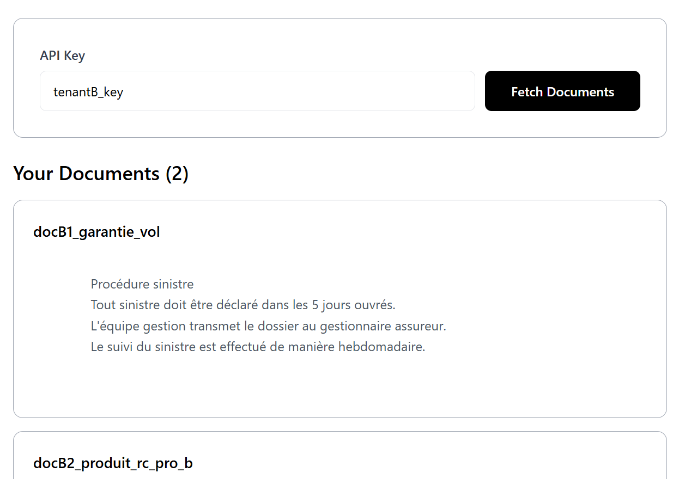
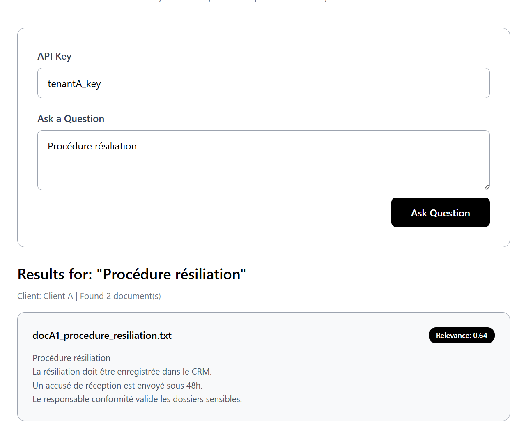
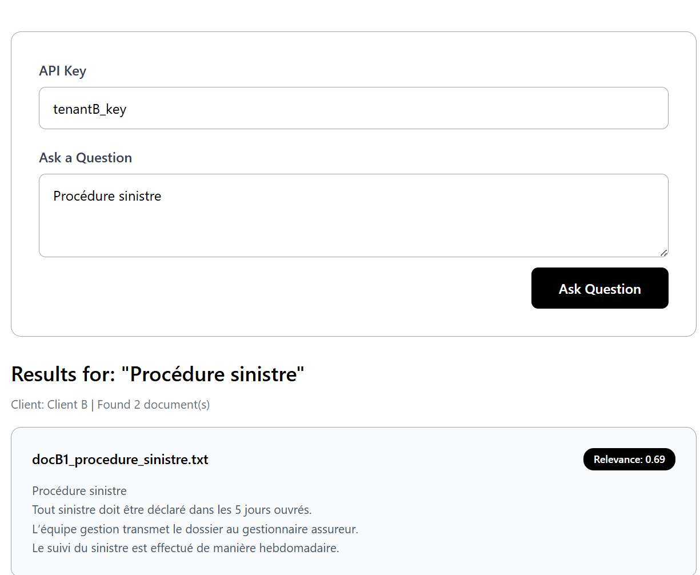
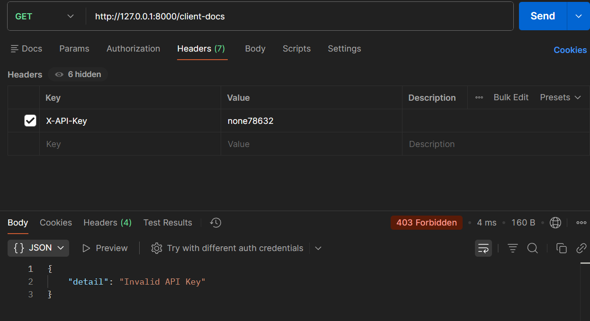

# Multi-Tenant Document Management System

A simple multi-tenant document management system with API key-based authentication, built with FastAPI (backend) and React (frontend).

## Description

This application demonstrates a secure multi-tenant architecture where multiple clients can access their own documents through API key authentication. Each client is isolated and can only view their own documents, ensuring complete data separation between tenants.

## Features

- **Multi-tenant Architecture**: Complete data isolation between clients
- **API Key Authentication**: Secure access control using HTTP headers
- **RESTful API**: Clean and simple API endpoints
- **React Frontend**: Simple and intuitive user interface
- **Error Handling**: Comprehensive error handling for all edge cases

## Architecture

### Backend (FastAPI + SQLAlchemy)

```
backend/
├── app/
│   ├── __init__.py
│   ├── main.py          # FastAPI application and routes
│   ├── models.py        # SQLAlchemy database models
│   └── database.py      # Database configuration
└── requirements.txt
```

**Database Schema:**

- `Client`: Stores client information
- `Key`: One-to-one relationship with Client (API keys)
- `Doc`: One-to-many relationship with Client (documents)

**API Endpoints:**

- `GET /` - Health check endpoint
- `GET /client-docs` - Retrieve documents for authenticated client

### Frontend (React + Vite + Tailwind CSS)

```
frontend/
├── src/
│   ├── App.jsx          # Main application component
│   └── main.jsx         # Application entry point
├── index.html
└── package.json
```

**Features:**

- API key input with validation
- Document display with clean UI
- Error handling for all backend responses
- Loading states for better UX
- Styled with Tailwind CSS for modern, responsive design
- Document display with clean UI
- Error handling for all backend responses
- Loading states for better UX

## How It Works

1. **Authentication**: Each client has a unique API key stored in the database
2. **Request Flow**:
   - Client enters API key in frontend
   - Frontend sends request to `/client-docs` with `X-API-Key` header
   - Backend validates API key and retrieves associated client
   - Backend filters and returns only documents belonging to that client
3. **Data Isolation**: Server-side filtering ensures clients can never access other clients' data

## Approach and Design Decisions

### Multi-tenant Architecture

The application implements a strict multi-tenant architecture where data isolation is enforced at the database level. Each client has:

- A unique identifier in the database
- A one-to-one relationship with an API key
- A one-to-many relationship with their documents

### Security Approach

- **API Key Authentication**: Client identity is determined by the `X-API-Key` header, never by request body parameters
- **Server-side Validation**: All authentication and authorization logic is handled on the backend
- **Database-level Filtering**: SQLAlchemy ORM ensures queries automatically filter by client_id
- **Error Handling**: Proper HTTP status codes (403 for unauthorized, 404 for not found, 500 for server errors)

### Technology Choices

- **FastAPI**: Chosen for its modern async support, automatic API documentation, and type safety
- **SQLAlchemy**: Provides robust ORM capabilities and relationship management
- **SQLite**: Lightweight database suitable for demonstration purposes
- **React + Vite**: Fast development with modern tooling and hot module replacement
- **Tailwind CSS**: Utility-first approach for rapid UI development with minimal custom CSS

### Implementation Highlights

- **Lifespan Events**: Database initialization and sample data loading on startup
- **Dependency Injection**: FastAPI's dependency system manages database sessions
- **Error Boundaries**: Try-catch blocks ensure HTTPExceptions are properly raised
- **Clean Separation**: Backend and frontend are completely decoupled, communicating only via HTTP

## Quick Start

### Option 1: Use PowerShell Script (Windows)

```powershell
.\start-project.ps1
```

This will automatically:

- Install backend dependencies
- Install frontend dependencies
- Start backend server on http://127.0.0.1:8000
- Start frontend server on http://localhost:5173

### Option 2: Manual Setup

#### Backend Setup

1. Navigate to backend directory:

```powershell
cd backend
```

2. Install dependencies:

```powershell
pip install -r requirements.txt
```

3. Start the server:

```powershell
uvicorn app.main:app --reload
```

Backend runs at: `http://127.0.0.1:8000`

#### Frontend Setup

1. Navigate to frontend directory:

```powershell
cd frontend
```

2. Install dependencies:

```powershell
npm install
```

3. Start development server:

```powershell
npm run dev
```

Frontend runs at: `http://localhost:5173`

## User Interface



The application features a clean, minimal interface with black and white color scheme. Users can enter their API key to access their documents.

## Testing

### Visual Testing Examples

The following screenshots demonstrate the different scenarios:

#### Client A - Valid Key



Using API key `tenantA_key` displays Client A's documents (procedure resiliation and RC Pro A).

#### Client B - Valid Key



Using API key `tenantB_key` displays Client B's documents (procedure sinistre and RC Pro B).

#### Invalid API Key



Using an invalid API key returns a 403 error with appropriate error message.

### Test Credentials

- API Key: `tenantA_key`
- Documents: 2 documents related to Client A

### Test Client B

- API Key: `tenantB_key`
- Documents: 2 documents related to Client B

### Using Frontend

1. Open `http://localhost:5173` in your browser
2. Enter one of the API keys above
3. Click "Fetch Documents" or press Enter
4. View the documents specific to that client

### Using Postman

1. Create a GET request to `http://127.0.0.1:8000/client-docs`
2. Add header: `X-API-Key` with value `tenantA_key` or `tenantB_key`
3. Send request and view the response

### Using curl

```bash
# Test Client A
curl -H "X-API-Key: tenantA_key" http://127.0.0.1:8000/client-docs

# Test Client B
curl -H "X-API-Key: tenantB_key" http://127.0.0.1:8000/client-docs
```

## Security Features

- **API Key Validation**: All requests require valid API key
- **Server-side Filtering**: Client isolation enforced at database level
- **Error Messages**: Proper HTTP status codes (403 for unauthorized, 404 for not found)
- **No Client ID in Request Body**: Client identification done via headers only

## Project Structure

```
test-technique/
├── backend/              # FastAPI backend application
│   ├── app/
│   │   ├── __init__.py
│   │   ├── main.py
│   │   ├── models.py
│   │   └── database.py
│   ├── requirements.txt
│   └── README.md
├── frontend/            # React frontend application
│   ├── src/
│   │   ├── App.jsx
│   │   └── main.jsx
│   ├── index.html
│   ├── package.json
│   └── README.md
├── data/               # Sample data files
├── README.md           # This file
└── start-project.ps1   # Launch script
```

## Technologies Used

### Backend

- **FastAPI**: Modern Python web framework
- **SQLAlchemy**: SQL toolkit and ORM
- **Uvicorn**: ASGI server
- **SQLite**: Database

### Frontend

- **React**: UI library
- **Vite**: Build tool
- **Tailwind CSS**: Utility-first CSS framework
- **Fetch API**: HTTP requests
