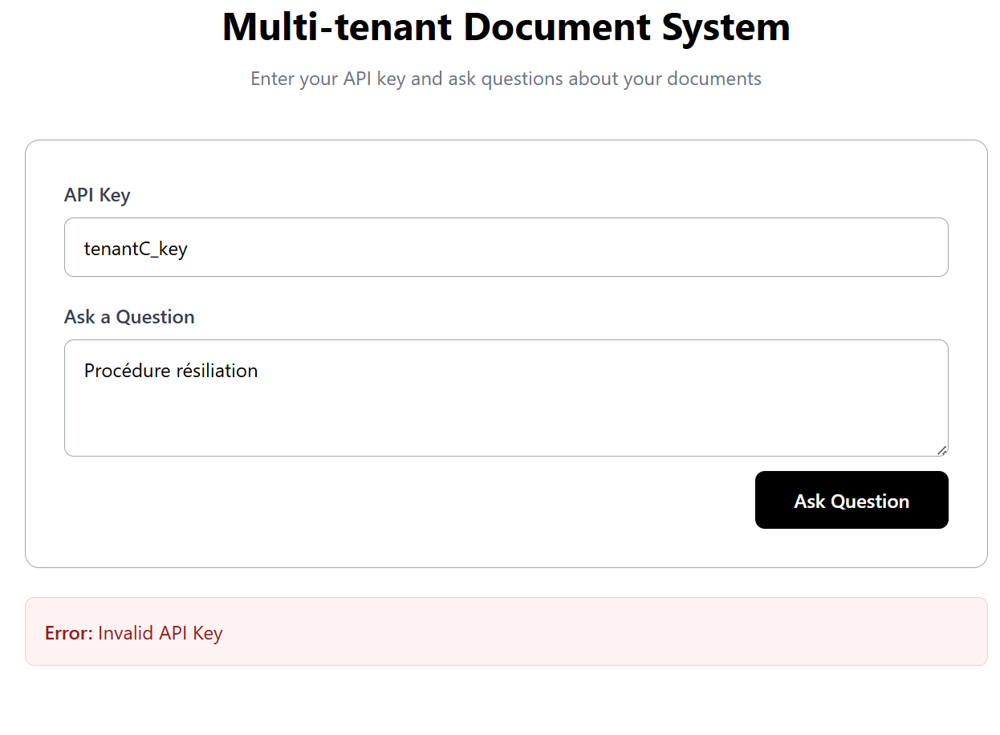

# Multi-Tenant Document Management System

A multi-tenant document management system with API key-based authentication and ChromaDB vector search, built with FastAPI (backend) and React (frontend).

## Description

This application demonstrates a secure multi-tenant architecture where clients can query their documents using natural language questions. Each client is isolated and can only access their own documents through API key authentication, with document storage and retrieval powered by ChromaDB.

## Features

- **Multi-tenant Architecture**: Complete data isolation between clients using client_id
- **API Key Authentication**: Secure access control using HTTP headers
- **Vector Search with ChromaDB**: Semantic search using embeddings for intelligent document retrieval
- **Natural Language Queries**: Ask questions in plain language and get relevant documents
- **RESTful API**: Clean API endpoints
- **React Frontend**: Simple and intuitive user interface
- **Persistent Storage**: ChromaDB data stored in persistent folder

## Architecture

### Backend (FastAPI + SQLAlchemy + ChromaDB)

```
backend/
├── app/
│   ├── __init__.py
│   ├── main.py          # FastAPI application and routes
│   ├── models.py        # SQLAlchemy database models
│   ├── database.py      # Database configuration
│   └── chromadb.py      # ChromaDB configuration
├── chroma_data/         # Persistent ChromaDB storage
└── requirements.txt
```

**Database Schema:**

- `Client`: Stores client information
- `Key`: One-to-one relationship with Client (API keys)

**ChromaDB Storage:**

- Documents stored with client_id metadata for multi-tenant isolation
- Vector embeddings for semantic search
- Persistent storage in `chroma_data/` folder

**API Endpoints:**

- `GET /` - Health check endpoint
- `POST /ask-question` - Query documents using natural language

### Frontend (React + Vite)

```
frontend/
├── src/
│   ├── App.jsx          # Main application component
│   └── main.jsx         # Application entry point
├── index.html
└── package.json
```

**Features:**

- API key input with validation
- Question input for natural language queries
- Display all relevant documents with relevance scores
- Error handling for all backend responses
- Loading states for better UX

## How It Works

1. **Authentication**: Each client has a unique API key and client_id stored in the database
2. **Document Storage**: Documents are loaded into ChromaDB with client_id metadata during initialization
3. **Query Flow**:
   - Client enters API key and question in frontend
   - Frontend sends POST request to `/ask-question` with `X-API-Key` header
   - Backend validates API key and retrieves client_id
   - ChromaDB performs semantic search filtered by client_id
   - Backend returns all relevant documents with relevance scores
4. **Data Isolation**: ChromaDB filtering by client_id ensures clients can never access other clients' data

## Approach and Design Decisions

### Multi-tenant Architecture

The application implements a strict multi-tenant architecture where data isolation is enforced using client_id:

- Each client has a unique identifier (client_id) in the database
- A one-to-one relationship with an API key
- Documents stored in ChromaDB with client_id metadata for filtering

### Security Approach

- **API Key Authentication**: Client identity is determined by the `X-API-Key` header
- **Server-side Validation**: All authentication and authorization logic is handled on the backend
- **ChromaDB Filtering**: Documents filtered by client_id ensuring complete tenant isolation
- **Error Handling**: Proper HTTP status codes (400 for bad request, 403 for unauthorized, 404 for not found, 500 for server errors)

### Technology Choices

- **FastAPI**: Modern async support, automatic API documentation, and type safety
- **SQLAlchemy**: Robust ORM capabilities for client and API key management
- **ChromaDB**: Vector database for semantic search with persistent storage
- **SQLite**: Lightweight database for client/key management
- **React + Vite**: Fast development with modern tooling

### Implementation Highlights

- **ChromaDB Integration**: Documents loaded during startup with client_id metadata
- **Persistent Storage**: ChromaDB data persisted in `chroma_data/` folder
- **Semantic Search**: Natural language queries return relevant documents with relevance scores
- **Lifespan Events**: Database and ChromaDB initialization on startup
- **Dependency Injection**: FastAPI's dependency system manages database sessions
- **Clean Separation**: Backend and frontend completely decoupled

## Quick Start

### Option 1: Use PowerShell Script (Windows)

```powershell
.\start-project.ps1
```

This will automatically:

- Install backend dependencies
- Install frontend dependencies
- Start backend server on http://127.0.0.1:8000
- Start frontend server on http://localhost:5173

### Option 2: Manual Setup

#### Backend Setup

1. Navigate to backend directory:

```powershell
cd backend
```

2. Install dependencies:

```powershell
pip install -r requirements.txt
```

3. Start the server:

```powershell
uvicorn app.main:app --reload
```

Backend runs at: `http://127.0.0.1:8000`

#### Frontend Setup

1. Navigate to frontend directory:

```powershell
cd frontend
```

2. Install dependencies:

```powershell
npm install
```

3. Start development server:

```powershell
npm run dev
```

Frontend runs at: `http://localhost:5173`

## User Interface

### Client A Example


Client A using API key `tenantA_key` to query their documents.

### Client B Example


Client B using API key `tenantB_key` to query their documents.

### Invalid API Key



Using an invalid API key returns a 403 error with appropriate error message.

## Testing

### Test Client A

- API Key: `tenantA_key`
- Documents: 2 documents (docA1_procedure_resiliation.txt, docA2_produit_rc_pro_a.txt)
- Example question: "What is the claims procedure?" or "What are the exclusions?"

### Test Client B

- API Key: `tenantB_key`
- Documents: 2 documents (docB1_procedure_sinistre.txt, docB2_produit_rc_pro_b.txt)
- Example question: "How do I report a claim?" or "What is covered?"

### Using Frontend

1. Open `http://localhost:5173` in your browser
2. Enter API key (`tenantA_key` or `tenantB_key`)
3. Type a question about the documents
4. Click "Ask Question" or press Enter
5. View all relevant documents with relevance scores

### Using Postman

1. Create a POST request to `http://127.0.0.1:8000/ask-question`
2. Add header: `X-API-Key` with value `tenantA_key` or `tenantB_key`
3. Add JSON body: `{"question": "What is the claims procedure?"}`
4. Send request and view the response

### Using curl

```bash
# Test Client A
curl -X POST http://127.0.0.1:8000/ask-question \
  -H "Content-Type: application/json" \
  -H "X-API-Key: tenantA_key" \
  -d '{"question": "What is the claims procedure?"}'

# Test Client B
curl -X POST http://127.0.0.1:8000/ask-question \
  -H "Content-Type: application/json" \
  -H "X-API-Key: tenantB_key" \
  -d '{"question": "How do I report a claim?"}'
```

## Security Features

- **API Key Validation**: All requests require valid API key
- **Client ID Isolation**: Document filtering by client_id in ChromaDB
- **Question Validation**: Empty questions are rejected with 400 status
- **Error Messages**: Proper HTTP status codes (400, 403, 404, 500)
- **Persistent Storage**: ChromaDB data persisted across restarts

## Project Structure

```
test-technique/
├── backend/              # FastAPI backend application
│   ├── app/
│   │   ├── __init__.py
│   │   ├── main.py
│   │   ├── models.py
│   │   └── database.py
│   ├── requirements.txt
│   └── README.md
├── frontend/            # React frontend application
│   ├── src/
│   │   ├── App.jsx
│   │   └── main.jsx
│   ├── index.html
│   ├── package.json
│   └── README.md
├── data/               # Sample data files
├── README.md           # This file
└── start-project.ps1   # Launch script
```

## Technologies Used

### Backend

- **FastAPI**: Modern Python web framework
- **SQLAlchemy**: SQL toolkit and ORM
- **ChromaDB**: Vector database for semantic search
- **Uvicorn**: ASGI server
- **SQLite**: Database for client/key management

### Frontend

- **React**: UI library
- **Vite**: Build tool
- **Fetch API**: HTTP requests
